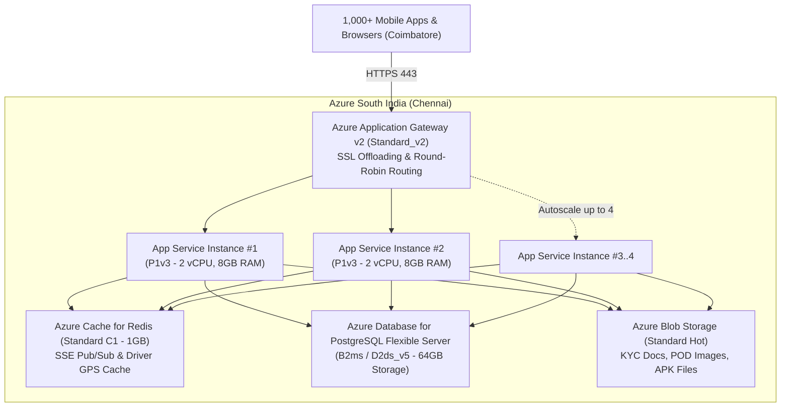

# 🌐 SwifLoad — Azure Cloud Infrastructure Architecture Guide
## High Availability, Load Balancing & Concurrency Scaling for Coimbatore Launch

This document provides a comprehensive technical blueprint and cost assessment for hosting the **SwifLoad** on-demand city logistics mobile application and web ecosystem on **Microsoft Azure**. It specifically addresses scaling to a minimum of **1,000 concurrent active users**, providing **traffic distribution and automated failover**, and implementing **runtime-configurable Maps and Payment systems** managed directly through the SwifLoad Admin Portal.

---

## 📑 Table of Contents
1. [Workload Profile & Concurrency Analysis (1,000 Users)](#1-workload-profile--concurrency-analysis-1000-users)
2. [Target Azure Geographic Regions (Coimbatore Focus)](#2-target-azure-geographic-regions-coimbatore-focus)
3. [Architecture Option 1: Basic Infrastructure (Cost-Effective / MVP)](#3-architecture-option-1-basic-infrastructure-cost-effective--mvp)
4. [Architecture Option 2: Recommended Infrastructure (Production High Availability & DR)](#4-architecture-option-2-recommended-infrastructure-production-high-availability--dr)
5. [Load Balancing & Automated Failover Mechanics](#5-load-balancing--automated-failover-mechanics)
6. [Dynamic Maps Provider Configuration Architecture](#6-dynamic-maps-provider-configuration-architecture)
7. [Dynamic Payment Gateway Configuration Architecture](#7-dynamic-payment-gateway-configuration-architecture)
8. [Side-by-Side Cost & Feature Comparison](#8-side-by-side-cost--feature-comparison)
9. [Step-by-Step Azure CLI Deployment Script](#9-step-by-step-azure-cli-deployment-script)

---

## 1. Workload Profile & Concurrency Analysis (1,000 Users)

In an on-demand logistics system operating in an urban cluster like Coimbatore, **1,000 concurrent users** exhibit the following operational traffic pattern:

| User Persona | Concurrent Count | Activity Profile | Traffic Footprint |
| :--- | :--- | :--- | :--- |
| **Driver-Partners** | 200 | App open, online status, GPS telemetry ping every 5–10s, order polling | Persistent SSE/WebSocket connection, ~30–40 RPS write/read |
| **Active Customers** | 780 | Searching drivers, calculating slab fares, booking deliveries, tracking active cargo | Page views, dynamic pricing calculations, SSE live trip tracking (~80–150 RPS) |
| **Admin & Dispatchers** | 20 | Live dashboard monitoring, tariff edits, KYC approvals, manual dispatch | Heavy query aggregation, real-time dispatch map streaming (~10–20 RPS) |

### Traffic & Resource Benchmarks:
- **Peak Throughput:** **150 – 250 Requests Per Second (RPS)**.
- **Persistent Real-Time Connections:** **1,000 concurrent long-lived HTTP SSE/WebSocket streams**.
- **Bandwidth Consumption:** ~8 – 18 Mbps sustained (excluding direct APK downloads served via CDN).
- **Database Operations:** ~250 – 400 IOPS (read/write mix: GPS coordinates, trip status transitions, wallet deductions).

> [!IMPORTANT]
> A single basic instance (e.g. B1 with local JSON storage) fails under this load because the local file locks on write and Node.js single-threaded event loop saturates with >500 open SSE sockets. **Scaling to 1,000+ users requires horizontal compute instances behind a Layer 7 Load Balancer, an external relational database with connection pooling, and a shared Redis memory cache for real-time pub/sub.**

---

## 2. Target Azure Geographic Regions (Coimbatore Focus)

To deliver sub-50ms latency for mobile drivers on 4G/5G networks in Coimbatore:

1. **Primary Production Region: `southindia` (Chennai, Tamil Nadu)**
   - **Physical Distance:** ~500 km from Coimbatore.
   - **Network Latency (RTT):** **8 – 14 ms** over Airtel, Jio, and Vi fiber backbones.
   - **Availability Zones:** 3 Availability Zones (AZ 1, AZ 2, AZ 3) available for zero-downtime intra-region failover.
   - **Regulatory Compliance:** 100% compliant with RBI payment data localization and Indian Digital Personal Data Protection (DPDP) Act.

2. **Secondary / Disaster Recovery Region: `centralindia` (Pune, Maharashtra)**
   - **Physical Distance:** ~1,100 km from Coimbatore.
   - **Network Latency (RTT):** **22 – 28 ms**.
   - **Role:** Paired DR region for cross-region disaster recovery, database geo-replication, and automated DNS failover if the Chennai datacenters encounter a catastrophic power or natural grid outage.

---

## 3. Architecture Option 1: Basic Infrastructure (Cost-Effective / MVP)

**Objective:** Safely support 1,000 concurrent users at the lowest possible operational expense with horizontal autoscaling and single-region redundancy.



### Components Specification:
1. **Load Balancer:** **Azure Application Gateway v2 (Standard_v2)**
   - Auto-scales between 2 and 5 instances based on throughput.
   - Performs SSL termination with free Azure-managed certificates.
   - Cookie-based session affinity and health probe monitoring on `/api/state`.
2. **Compute Tier:** **Azure App Service (Linux) - Premium v3 (P1v3)**
   - **Specs:** 2 vCPU, 8 GB RAM per instance.
   - **Autoscale Rules:** Minimum 2 instances (for zero-downtime rolling deployments); scales up to 4 instances when CPU utilization exceeds 70% or HTTP Queue Length > 100.
   - Containerized deployment using Docker container from Azure Container Registry.
3. **Database Tier:** **Azure Database for PostgreSQL (Flexible Server)**
   - **Tier:** Standard_B2ms (2 vCPUs, 8 GB RAM) or Standard_D2ds_v5.
   - 64 GB Premium SSD with automated 35-day backup retention.
4. **Caching & Event Bus:** **Azure Cache for Redis (Standard C1 - 1 GB)**
   - Dual-node primary/replica setup managed by Azure with 99.9% SLA.
   - Offloads driver location broadcasts and syncs SSE streams across app instances.
5. **Static Assets & Storage:** **Azure Blob Storage (Standard LRS Hot)**
   - Stores Driver KYC documents, Cargo Proof-of-Delivery photos, and Android APK downloads (`SwifLoad-Customer.apk`, `SwifLoad-Driver.apk`).

---

## 4. Architecture Option 2: Recommended Infrastructure (Production High Availability & DR)

**Objective:** Zero unplanned downtime, enterprise-grade security (WAF), automated multi-zone failover, cross-region disaster recovery, and sub-10ms response times.

```mermaid
flowchart TD
    Users["Mobile Clients (Android APKs, PWAs, Web)"] -->|Anycast Routing| FrontDoor["Azure Front Door Premium<br/>Global Edge, WAF, SSL, Anycast, Health Probes"]
    
    FrontDoor -->|Primary Active (Weighted 100)| AppGW_South["Azure App Gateway v2 (WAF_v2)<br/>South India (Chennai)"]
    FrontDoor -.->|Standby Failover (Health Check Fail)| AppGW_Central["Azure App Gateway v2<br/>Central India (Pune)"]

    subgraph SouthRegion ["South India (Chennai) — Active Multi-AZ"]
        AppGW_South --> AZ1["AZ-1 App Service P1v3"]
        AppGW_South --> AZ2["AZ-2 App Service P1v3"]
        AppGW_South --> AZ3["AZ-3 App Service P1v3"]
        
        AZ1 & AZ2 & AZ3 --> Redis_Prem["Azure Redis Premium (P1)<br/>Multi-Zone Redundant"]
        AZ1 & AZ2 & AZ3 --> SvcBus["Azure Service Bus Standard<br/>Trip State & Payment Webhooks"]
        AZ1 & AZ2 & AZ3 --> PG_Primary["PostgreSQL Flexible Server (D4ds_v5)<br/>Primary (AZ-1)"]
        PG_Primary <==>|Sync Replication| PG_Standby["PostgreSQL Standby (AZ-2)<br/>Auto-Failover <60s"]
    end

    subgraph CentralRegion ["Central India (Pune) — Hot Standby DR"]
        AppGW_Central --> DR_AppSvc["App Service (1 Instance Standby)"]
        DR_AppSvc --> PG_Replica["PostgreSQL Async Read-Replica"]
    end

    PG_Primary -.->|Async Geo-Replication| PG_Replica
    KeyVault["Azure Key Vault<br/>Payment & Maps Secrets"] -.->|Managed Identity| AZ1 & AZ2 & AZ3 & DR_AppSvc
```

### Components Specification:
1. **Edge Routing & Perimeter Security:** **Azure Front Door (AFD) Premium**
   - Directs mobile traffic through Microsoft’s global Anycast edge network (nearest edge Point-of-Presence in Chennai/Bengaluru).
   - **Web Application Firewall (WAF):** Real-time protection against SQL injection, cross-site scripting (XSS), bot scraper networks, and rate-based DDoS attacks.
   - **Global Failover:** Automatically switches traffic to Central India within 30 seconds if South India endpoints fail health checks.
2. **Regional Application Gateway:** **Azure Application Gateway v2 (WAF_v2)**
   - Internal load balancer terminating Front Door connections and routing across private subnets.
3. **Compute Tier:** **Azure App Service (Linux) - Zone Redundant (P1v3 / P2v3)**
   - Deployed across **3 Availability Zones** in South India.
   - Minimum 3 instances (1 per zone), auto-scaling up to 8–10 instances during flash delivery hours.
4. **Database Tier:** **Azure Database for PostgreSQL (Flexible Server) - D4ds_v5**
   - **4 vCPUs, 16 GB RAM**, 128 GB Storage, 5,000 IOPS.
   - **Zone-Redundant High Availability:** Synchronous replication between AZ-1 and AZ-2. Instant automatic failover with zero data loss in case of hardware or zone failure.
   - **Cross-Region Read Replica:** Asynchronously replicated to `centralindia` for instant DR read-readiness and analytics queries.
5. **Real-Time Engine:** **Azure Web PubSub / Redis Premium (P1)**
   - Offloads persistent WebSocket/SSE connections completely from the Next.js application servers, enabling up to 20,000+ simultaneous connected devices with zero CPU penalty on the web app.
6. **Decoupled Asynchronous Messaging:** **Azure Service Bus (Standard)**
   - Buffers ride requests, driver dispatch timeouts, SMS OTP delivery, and payment settlement webhooks.
7. **Security & Governance:** **Azure Key Vault + Azure Managed Identity**
   - No plaintext secrets or API keys stored in code or repository.
   - Next.js fetches dynamic Google Maps, Mappls, Razorpay, and Cashfree credentials via zero-trust managed identity tokens.

---

## 5. Load Balancing & Automated Failover Mechanics

### How Incoming Mobile Traffic is Managed:
```
Mobile App Request -> Azure Front Door (Edge WAF) -> Application Gateway v2 (Health Probe Check) -> App Service Node (Round Robin)
```

1. **Health Probes (`/api/state` or `/api/health`):**
   - Probe interval: Every 10 seconds.
   - Unhealthy threshold: 2 consecutive failures.
   - If an App Service instance crashes or runs out of memory, the Load Balancer cuts traffic to that instance within **20 seconds** with zero dropped user requests.
2. **Session Statelessness:**
   - User authentication and trip states are maintained using **JWT / Bearer Tokens** and **Redis-backed sessions**.
   - A user who switches from 4G to Wi-Fi while driving through Coimbatore (e.g. from Peelamedu to Gandhipuram) maintains uninterrupted connection even if routed to a different server instance.
3. **Graceful Failover Execution:**
   - **Intra-Region (Zone Failure):** Application Gateway automatically shifts 100% of requests to surviving zones. PostgreSQL switches to the standby zone in **<60 seconds**.
   - **Catastrophic Region Failure:** Azure Front Door detects the primary backend pool failure and pivots DNS traffic to the Central India secondary cluster in **<30 seconds**.

---

## 6. Dynamic Maps Provider Configuration Architecture

The platform requires switching between maps providers (OpenStreetMap, Google Maps, Mapbox, MapmyIndia/Mappls) without redeploying code.

### 1. Database Configuration Schema (`SystemConfig.maps`)
```typescript
export interface MapsConfig {
  activeProvider: 'openstreetmap' | 'google_maps' | 'mapbox' | 'mappls';
  defaultCenter: { lat: number; lng: number }; // [11.0168, 76.9558] (Coimbatore)
  defaultZoom: number; // 13
  providers: {
    openstreetmap: {
      enabled: boolean;
      tileUrl: string; // "https://{s}.tile.openstreetmap.org/{z}/{x}/{y}.png"
      attribution: string;
    };
    google_maps: {
      enabled: boolean;
      apiKey: string; // Stored securely
      mapId?: string;
    };
    mapbox: {
      enabled: boolean;
      accessToken: string;
      styleUrl: string;
    };
    mappls: { // MapmyIndia
      enabled: boolean;
      clientId: string;
      clientSecret: string;
      restApiKey: string;
    };
  };
}
```

### 2. Provider Strengths for Coimbatore Launch:
- **MapmyIndia (Mappls):** ⭐ **Highly Recommended for Coimbatore.** Features India-specific local door/gate numbers, Tamil Nadu junction landmarks (e.g. *Lakshmi Mills Junction, Hope College, Town Hall, Gandhipuram Bus Stand*), and hyper-accurate commercial building entries.
- **OpenStreetMap / Leaflet:** Default open-source fallback with zero per-request licensing costs.
- **Google Maps:** Exceptional routing and traffic congestion estimation along Avinashi Road, Trichy Road, and Sathy Road.

### 3. Dynamic Rendering in Admin & Apps:
- The Admin Portal provides a settings card with radio buttons to toggle the active map provider.
- Client applications request `/api/config` on startup. The API returns the **active provider name and public client key only** (secret tokens are strictly kept on the server).
- The map component uses a standard abstraction interface (`<DynamicMapView />`) that switches between Leaflet TileLayer, Google Maps JavaScript SDK, or Mappls GL based on the active config.

---

## 7. Dynamic Payment Gateway Configuration Architecture

The platform supports multiple payment gateways (Razorpay, Cashfree, PhonePe, Stripe, Wallet, COD) dynamically selected and configured via Admin.

### 1. Database Configuration Schema (`SystemConfig.payments`)
```typescript
export interface PaymentsConfig {
  activeGateway: 'razorpay' | 'cashfree' | 'phonepe' | 'stripe';
  supportedMethods: {
    upiGpay: boolean;
    upiPhonePe: boolean;
    upiPaytm: boolean;
    netbanking: boolean;
    cashOnDelivery: boolean;
    driverWallet: boolean;
  };
  gateways: {
    razorpay: {
      enabled: boolean;
      keyId: string;        // Public key sent to mobile client
      keySecret: string;    // Kept securely in Azure Key Vault
      webhookSecret: string;
    };
    cashfree: {
      enabled: boolean;
      appId: string;
      secretKey: string;
      environment: 'SANDBOX' | 'PRODUCTION';
    };
    phonepe: {
      enabled: boolean;
      merchantId: string;
      saltKey: string;
      saltIndex: number;
    };
    stripe: {
      enabled: boolean;
      publishableKey: string;
      secretKey: string;
    };
  };
}
```

### 2. Google Pay (GPay) Deep Integration Architecture

Google Pay (GPay) is the dominant digital payment method in Coimbatore and Tamil Nadu. SwifLoad supports GPay through a **hybrid dual-execution model**:

#### A. Native Android UPI Intent Flow (Zero Gateway Fees / 0% MDR)
When the customer books a vehicle from the SwifLoad native Android APK:
1. The app invokes the Android Intent URI scheme:
   ```
   upi://pay?pa=swifload.cbe@icici&pn=SwifLoad%20Logistics&mc=4215&tr=TRIP_CBE_894&tn=SwifLoad%20Trip%20Fare&am=380.00&cu=INR&url=https://swifload-cbe.azurewebsites.net/api/payments/verify
   ```
2. Android directly surfaces the **Google Pay** app (`com.google.android.apps.nbu.paisa.user`).
3. The customer authorizes with their UPI PIN (biometrics / PIN).
4. Google Pay broadcasts payment status directly back to the SwifLoad Android activity with transaction reference ID (`txnRef`), instantaneously completing the booking.

#### B. In-App Payment Gateway & Web Collect (Omnichannel Fallback)
For customers on desktop/mobile browsers or when automated ledger reconciliation is requested:
1. SwifLoad invokes the **Google Pay Web API / Razorpay GPay In-App SDK**.
2. Customers approve via instant UPI push notification or on-screen QR code.
3. Razorpay/PhonePe dispatches cryptographic HMAC-SHA256 webhook to `/api/payments/webhook`.
4. Azure backend validates signature, automatically settles platform commission (18%) and credits the driver wallet.

#### C. Admin Portal Configurable Parameters for GPay:
- **`gpayMerchantVpa`:** Configurable target UPI Virtual Payment Address (e.g. `swifload.logistics@icici`).
- **`gpayMerchantName`:** Verified display title (`SwifLoad Logistics Coimbatore`).
- **`gpayMerchantId`:** Google Pay Business Console Merchant ID.
- **`gpayRoutingMode`:** Dynamic toggle between **Direct UPI Intent** (0% transaction charge) and **Gateway Managed** (auto-reconciliation).

---

### 3. Secure Payment Lifecycle:
1. **Step 1 (Order Creation):** Customer requests checkout. Mobile app calls `/api/payments/create-order`.
2. **Step 2 (Server Orchestration):** Backend reads `activeGateway` from DB/Cache. If `razorpay` is active, it calls Razorpay Orders API server-to-server.
3. **Step 3 (Client Checkout):** Returns the `order_id` and the gateway's public key (`keyId`). The Android APK or browser opens the native GPay / Razorpay checkout sheet.
4. **Step 4 (Webhook Verification):** Payment gateway dispatches cryptographic webhook to `/api/payments/webhook`. Backend verifies the HMAC SHA256 signature, credits the driver wallet, and marks the trip `PAID`.

---

## 8. Side-by-Side Cost & Feature Comparison

| Architectural Aspect | Option 1: Basic (MVP Launch) | Option 2: Recommended (Enterprise HA) |
| :--- | :--- | :--- |
| **Max Concurrent Users** | 1,000 – 1,500 | 5,000 – 15,000+ |
| **Primary Region** | South India (Chennai) | South India (Chennai) + Central India DR |
| **Edge & Load Balancer** | Azure Application Gateway v2 | Azure Front Door Premium + App Gateway v2 |
| **Compute Tier** | App Service Linux (P1v3, 2–4 instances) | App Service Linux (P1v3 Multi-AZ, 3–10 instances) |
| **Database Tier** | PostgreSQL Flex (B2ms / D2ds_v5) | PostgreSQL Flex (D4ds_v5) Zone-Redundant + Replica |
| **Caching / PubSub** | Azure Cache for Redis Standard (C1) | Azure Cache for Redis Premium (P1) / Web PubSub |
| **High Availability SLA** | 99.9% (~43 mins downtime/mo) | 99.99% (<4.3 mins downtime/mo) |
| **Failover Capability** | Manual restart or single-region recovery | Automated Multi-Zone & Multi-Region (<30s) |
| **WAF & Security** | Standard App Gateway SSL | Enterprise Front Door WAF + Managed Key Vault |
| **Est. Monthly Cost (INR)** | **~₹16,500 – ₹24,000 / month** | **~₹58,000 – ₹85,000 / month** |
| **Est. Monthly Cost (USD)** | **~$195 – $290 / month** | **~$695 – $1,020 / month** |

---

## 9. Step-by-Step Azure CLI Deployment Script

To quickly stand up the **Basic Infrastructure (Option 1)** in the **South India** region:

```bash
# 1. Variables
RESOURCE_GROUP="rg-swifload-prod"
LOCATION="southindia"
PLAN_NAME="plan-swifload-prod"
APP_NAME="swifload-cbe-prod"
ACR_NAME="acrswifload"
PG_SERVER="pg-swifload-prod"
REDIS_NAME="redis-swifload-prod"

# 2. Create Resource Group
az group create --name $RESOURCE_GROUP --location $LOCATION

# 3. Create Azure Cache for Redis (Standard C1)
az redis create \
  --name $REDIS_NAME \
  --resource-group $RESOURCE_GROUP \
  --location $LOCATION \
  --sku Standard \
  --vm-size c1

# 4. Create Azure Database for PostgreSQL (Flexible Server)
az postgres flexible-server create \
  --resource-group $RESOURCE_GROUP \
  --name $PG_SERVER \
  --location $LOCATION \
  --admin-user swifadmin \
  --admin-password "P@ssw0rdSwifLoad2026" \
  --sku-name Standard_D2ds_v5 \
  --tier GeneralPurpose \
  --storage-size 64

# 5. Create App Service Plan (Premium v3 - Linux)
az appservice plan create \
  --name $PLAN_NAME \
  --resource-group $RESOURCE_GROUP \
  --location $LOCATION \
  --is-linux \
  --sku P1V3 \
  --number-of-workers 2

# 6. Create Web App configured with Docker Container
az webapp create \
  --resource-group $RESOURCE_GROUP \
  --plan $PLAN_NAME \
  --name $APP_NAME \
  --deployment-container-image-name "$ACR_NAME.azurecr.io/swifload:latest"

# 7. Configure Container & Connection Settings
az webapp config appsettings set \
  --resource-group $RESOURCE_GROUP \
  --name $APP_NAME \
  --settings \
    WEBSITES_PORT=8080 \
    NODE_ENV=production \
    DEFAULT_HUB_CITY="Coimbatore" \
    NEXT_PUBLIC_DEFAULT_CITY="Coimbatore"

# 8. Configure Horizontal Autoscale (Scale to 4 instances on 70% CPU)
az monitor autoscale-rule create \
  --resource-group $RESOURCE_GROUP \
  --autoscale-name "autoscale-$PLAN_NAME" \
  --scale-mode-type ChangeCount \
  --scale-mode-value 1 \
  --scale-mode-direction Increase \
  --scale-mode-cooldown 5 \
  --condition "Percentage CPU > 70 avg 5m"
```

---

## 🎯 Summary Recommendation for Launch

For the initial launch in Coimbatore:
1. **Launch on Option 1 (Basic / Cost-Effective)** in **South India (Chennai)**: It comfortably absorbs **1,000 – 1,500 concurrent users** at **₹16,500 – ₹24,000/month**, keeping initial runway burn minimal while maintaining horizontal scalability and zero-downtime rolling deploys.
2. **Configure Mappls (MapmyIndia)** as the primary map provider in the Admin Portal for Tamil Nadu road and door-level address accuracy, with OpenStreetMap as zero-cost fallback.
3. **Configure Razorpay + PhonePe** in the Admin Portal to cover 98%+ of local UPI payments (GPay, PhonePe, Paytm, QR).
4. **Transition to Option 2 (Recommended)** when scaling to other Tamil Nadu hubs (Tirupur, Salem, Erode, Madurai, Chennai) or when peak concurrency exceeds 2,500 users.
